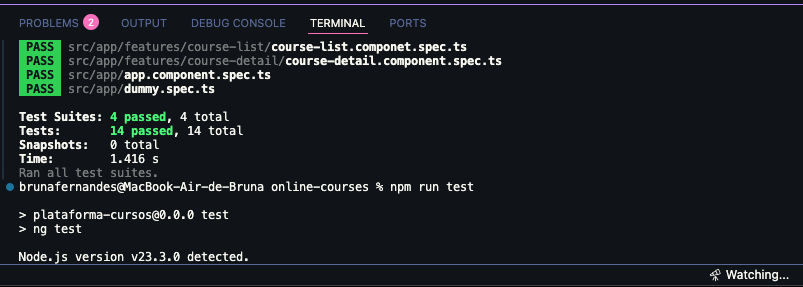
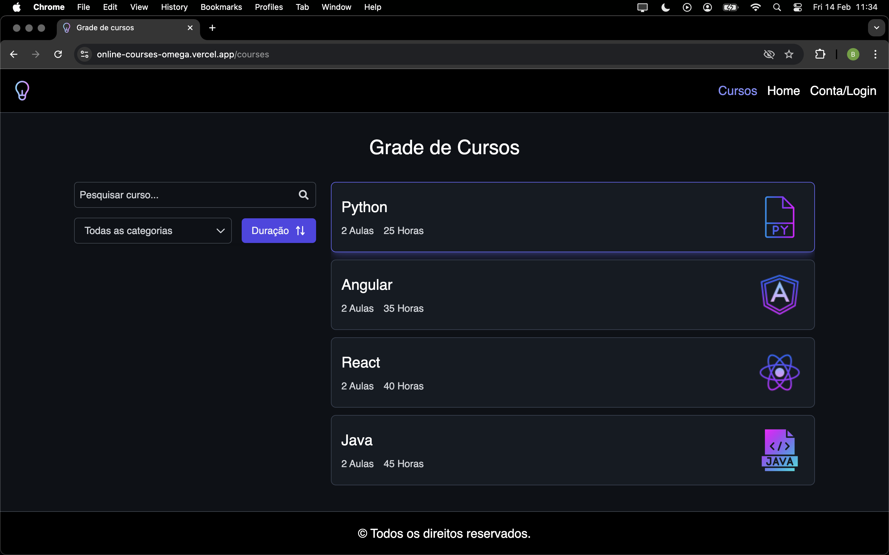

# Plataforma de Cursos Online

A versão mais recente da aplicação está disponível em: 🔗 [**Vercel**](https://online-courses-omega.vercel.app)
<br>
Desenvolvida em **Angular**, com **Tailwind CSS**, **RxJS** e testes utilizando **Jest**, esta aplicação front-end oferece uma plataforma de cursos online. Ela permite que os usuários:

- Naveguem e visualizem cursos.
- Filtram cursos por categorias específicas.
- Acessem detalhes de cada curso individualmente.

Proporcionando uma experiência de aprendizado **intuitiva** e **interativa**.

## Pré-requisitos

Antes de começar, você precisa ter as seguintes ferramentas instaladas:

- [Git](https://git-scm.com)
- [Node.js](https://nodejs.org/en/)
- [Angular CLI](https://cli.angular.io/)

## Instalação 

Para executar este projeto localmente, siga os passos abaixo:

1. Clone o repositório com o comando:

    ```bash
    git clone https://github.com/brunaa-f/online-courses
    ```

2. Navegue até o diretório do projeto:

   ```bash
   cd online-courses
3. Instação das dependências usando o npm:

    ```bash
    npm install
    ```

## Execução

Execute o seguinte comando `npm start`. Acesse `http://localhost:4200/` em seu navegador. A aplicação será recarregada automaticamente caso você faça alguma alteração nos arquivos de origem.


## Executando testes unitários 

Para executar os testes unitários, utilize o comando `npm run test`. Isso acionará os testes via [Jest](https://jestjs.io/pt-BR/).



## Preview



